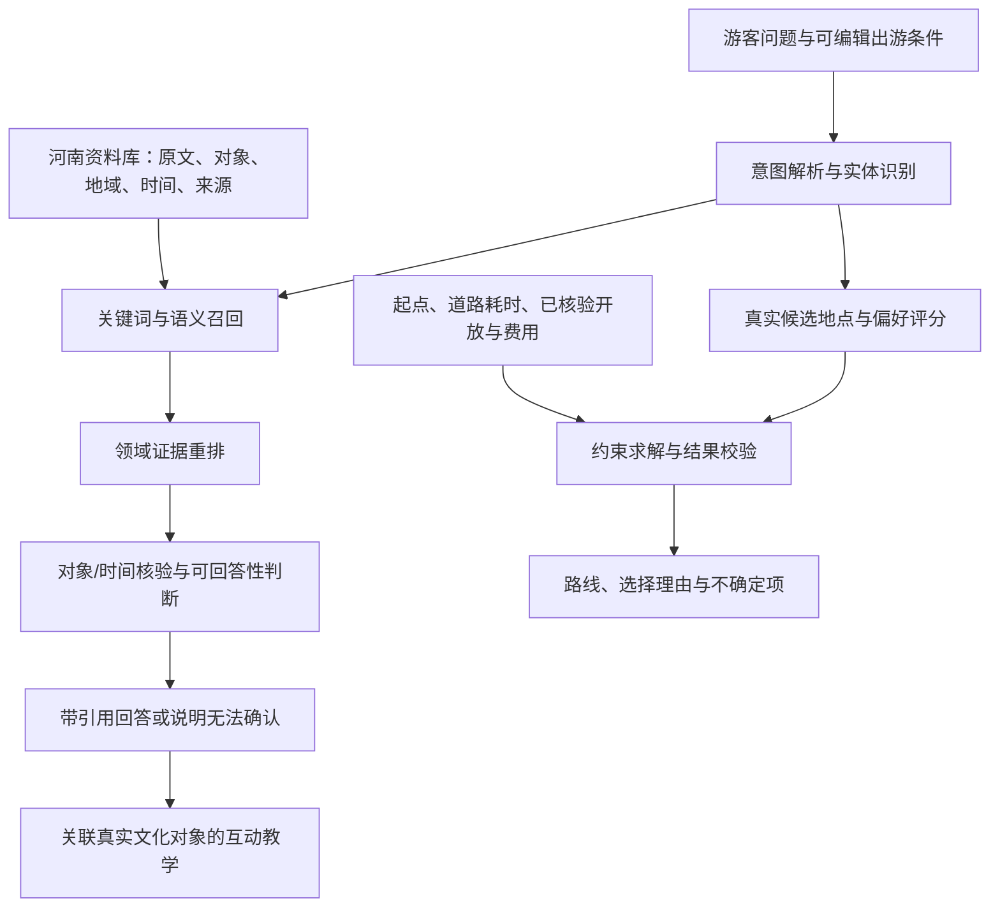

> **修复前历史审查 · 当前状态已更新**
>
> 本文记录 2026-09-22 本轮修改前的问题与拟定方案，保留原文用于追溯。文中的旧数据数量、代码行号、测试统计及“尚未完成替换”等表述不代表当前版本。已实施修复和本轮验证请看 [本轮整改记录-2026-09-22](本轮整改记录-2026-09-22.md)，实际材料请看 [河南真实资料与图片清单](河南真实资料与图片清单.md)。
>
> 后续模型训练、数据规模、指标与部署建议仍是规划，**本轮没有执行训练，也没有取得微调模型效果**。道路矩阵、正式 AppID、真机及发布亦须以当前整改记录的边界为准。

# 瓜游记：项目审查、河南真实材料整改与模型技术路线

审查日期：2026-09-22。对象：当前微信小程序、Node 服务、数据目录、测试及交付说明。

**结论：现有工程已经是可运行的开发原型，但还不是资料、行程和经营信息均可用于真实出游的产品。下一步先修数据与逻辑，再做可度量的模型改进。**

用户最新要求优先于早期原型设计：面向用户的地点、文化事实、照片必须对应真实河南对象。旧版允许的虚构站点、模拟经营数据、AI 场景配图，不再满足新版内容要求。本文是审查及整改方案，尚未完成这些替换。

## 1. 审查依据与验证边界

- 检查了当前源代码、ZCode 会话 `sess_8615f6d3-ee75-45a0-95bb-82a039989560` 的可见工作记录、已有原生页面截图及测试记录。
- 当前工程测试 **82/82 通过**；项目检查通过，覆盖 9 个页面、48 个 JS 文件、14 个 JSON 文件。静态包内资源统计为 1,035,874 字节；开发版 ZIP 约 1.28 MB，白名单文件与源码哈希一致。这些统计口径不同。
- 另用独立输入和受控模型返回值复现了路线、问答、字段覆盖、容量和日志问题，结果见 `test-results/audit-2026-09-22/reproductions.json`（本地历史记录，未上传仓库）。
- 本轮未读取 API 密钥，未调用付费模型接口，未训练模型，未修改应用业务代码。模型异常输出测试使用模拟返回值，不能解释为 DeepSeek 已经实际说过这些话。
- 既有原生导航测试 mock 了 `wx.openLocation`；本轮没有完成 iOS/Android 真机道路导航验收。页面截图和控制器测试不等于真机导航证据。

## 2. 优先处理的问题

P1 表示进入真实使用或作为核心能力参赛陈述前必须解决；P2 表示影响功能正确性、可信度或后续扩展；P3 表示体验与说明问题。优先级不表示本轮已经修复。

### P1-01：10 个地点都是虚构 POI，4 张主要配图都是 AI 图

定位：[catalog.js](../miniprogram/data/catalog.js#L48)、[配图说明](../docs/河南场景配图说明.md#L1)。

当前数据有 7 个来源、22 条文化事实、10 个演示站点。文化事实有出处，但站点名称、坐标、开放时间、收费和容量为模拟。四张 `henan-*.jpg` 是写实风格生成图，并非河南实拍；其中手作图是面食场景，也不能充当瓜豆酱制作照片。

旧版已明示演示属性，不应说成有意隐瞒；但它明确不满足用户本轮的新要求。整改必须更换内容和数据，不能仅去掉“演示”字样。

**处理：**真实文化条目、真实可访问地点、历史活动分别建档。没有当前营业证据的文化实体可以阅读，不能变成可预约的门店。未核实价格、开放时间、坐标和名额置空；未知价格不能按零元算预算，未知营业时间不能作为已满足的开放约束。

### P1-02：真实地图和行程算法使用两套空间数据

定位：[core.js:93](../miniprogram/lib/core.js#L93)。

`travel()` 不读取地图经纬度，而按抽象网格计算交通耗时。实际复现：`summer-kitchen → summer-festival` 的地图点直线距离约 **18.65 公里**，步行计划只有 **25 分钟**，意味着至少 44.8 km/h。直线距离不是道路距离，但已足以证明这个步行计划不成立。

算法还没有真实出发点，页面却计算“含往返”。线路上的虚线只是点序连接，没有调用道路路线求解。

**处理：**起点、终点、POI 和规划器使用同一地理数据源；坐标记录坐标系及核验依据。接入按交通方式获取的道路耗时矩阵，记录获取时间与降级状态。无可靠路网时间时显示粗略估算，不能承诺分钟级到达。规划后另做约束检查和空间合理性检查，避免求解与校验共同使用同一错误假设。

### P1-03：文化问答会拒绝可答的口语，也会拿无关资料作答

定位：[core.js:197](../miniprogram/lib/core.js#L197)、[tasks.js:16](../server/tasks.js#L16)。

| 输入与上下文 | 实际结果 | 问题 |
|---|---|---|
| 在乡味页问“瓜豆酱的原料有哪些？” | 返回黄豆、西瓜的核验条目 | 正常对照 |
| 同页问“做这个酱需要哪些东西？” | 拒答 | 没有处理口语及上下文指代 |
| 在瓜田文化页问“讲讲兵马俑的故事” | 返回西瓜栽培与农耕展陈资料 | 有引用但答非所问 |
| 问“这种种瓜手艺被列入哪一级保护名录？” | 返回名录项目数量 | 资料相关但未回答所问级别 |

服务先调用本地关键词规则；本地拒答就直接结束，本地选中的少量条目才交给 DeepSeek。模型因此无法补回漏召回的资料。服务异常时还会退回原有规则结果。

**处理：**先在完整资料库召回，再重排、核对地域/对象/时间和判断证据是否足够。无法回答时说明资料边界。“存在 sourceId”“与主题相关”和“能支持答案”是三个不同条件。保留服务端用核验事实构造答案的机制，不必改成自由生成所有事实。

### P1-04：活动文字校验拦不住编造事实或与容量矛盾

定位：[tasks.js:63](../server/tasks.js#L63)。

受控测试输入容量 8、已占 8，模拟模型返回“国家级非遗千年技艺体验”“明天已开放预约，还可接待99人，门票99元，保证提升销量”，系统全部接受，同时结构字段显示剩余 0。

当前只验证正文类型、长度和步骤数量；提示词中的“不要添加”不是程序保证。

**处理：**新版没有真实经营数据时先撤下模拟经营仪表盘。未来活动建议保留为用户主动生成的未发布草案，不能出现在真实活动列表。模型只选择审核过的文化事实和活动形式；时间、名额、价格、级别由核验字段确定，满员时走固定分支。建议文字与事实陈述分开校验。

### P1-05：对外部署的 AI 鉴权链路没有接通

定位：[config.js:36](../server/config.js#L36)、[app.js:93](../server/app.js#L93)、[service.js:11](../miniprogram/lib/service.js#L11)。

非本机监听要求服务令牌，POST 校验 Bearer；小程序请求只发送 content-type，没有会话鉴权。独立本地联通复现：健康检查 200，真实客户端 POST 401，客户端返回 `local-rules`。因此“检查连接成功”不代表模型功能可用。

**处理：**开发体验实现受限的短期配对会话；正式环境用微信登录换后端短期会话。检查页面区分服务可达、会话有效和模型可用。不能把固定管理令牌或 DeepSeek 密钥写进小程序。补充实际客户端到带鉴权服务的联通测试。

### P2-01：AI 解析能改动用户没说过的条件

定位：[tasks.js:28](../server/tasks.js#L28)。

用户只说“喜欢拍照”，受控模型返回预算 99,999 元、20 人、720 分钟及空缺失字段，系统接受。字段合法性校验无法证明字段来自用户表达。

**处理：**改为有证据的字段增量：`changes[{field,value,evidenceSpan}]`。校验证据片段确实在输入中，并核验数字、单位、否定及字段语义；仅有原文片段还不够。未表达字段保持原值，缺失状态由服务端计算，界面展示更改摘要。相对日期基于明确时区和当前日期解析。

### 其他应在同一轮修复的问题

| 级别 | 发现与后果 | 修复及验收 |
|---|---|---|
| P2 | [profile.js:32](../miniprogram/pages/profile/profile.js#L32)：请求期间手动将预算 160 改为 450，响应后被旧值覆盖 | 请求版本及字段修改标记；只合并未被用户改动的字段，或解析时锁定相关表单 |
| P2 | [profile.wxml:36](../miniprogram/pages/profile/profile.wxml#L36)：助农开关写着调整推荐，算法未读取它 | 在有可核验助农目标前撤掉效果承诺；未来启用可解释权重并做开关对照 |
| P2 | [core.js:115](../miniprogram/lib/core.js#L115)：本机意向已满的站点仍被推荐 | 意向不能等同库存。真实场次须按日期统一容量；当前没有数据就取消剩余名额与占位语义 |
| P2 | [store.js:128](../miniprogram/lib/store.js#L128)：日志丢掉排除站点、拒答与模拟标志 | 定义最小事件结构，保留曝光/选择/排除、推荐与模型版本、来源版本、演示标记；先征得用户数据使用选择 |
| P2 | 解析支持公交/骑行/2.5 小时，表单未完整显示和编辑这些条件 | 所有影响规划的已解析条件均可见、可改；能力未接通的交通方式暂不生成精确路线 |
| P2 | [test-route-ui.js:275](../scripts/test-route-ui.js#L275)：mock 导航被命名为拉起真实地图 | 改成参数/调用流程验证；补真机成功、失败、拒绝权限及返回测试；导航失败需界面反馈 |
| P2 | [store.js:9](../miniprogram/lib/store.js#L9)：云端默认开启，与文档“显式启用”不一致 | 发送点就近说明发送的字段和接收方，保存选择；这里是行为与说明问题，不作法律认定 |
| P3 | 地图全部长标题常显，已有截图的边缘标签裁切 | 适当视野留白，只展开选中站点标题；375/430 宽度检查，选中点与列表同步 |

## 3. 河南真实材料与清晰图片：新版入库标准

### 3.1 先做少量真实内容，不把虚构点改名充数

| 旧内容 | 新版处理 |
|---|---|
| 瓜田文化书屋、夏日瓜田观察站 | 合并为中牟西瓜栽培文化专题。市级名录可引用，但不据此制造书屋、果园或可访问坐标 |
| 乡味手作小院 | 改为青谷堆村瓜豆酱文化资料。2021 年官方教学报道证明文化记录，不能证明今天存在开放的体验店 |
| 吃瓜记忆展廊 | 改为“2024 中牟吃瓜大会”历史活动记录；不制造展廊或 2026 活动 |
| 瓜香慢游茶歇 | 删除虚构商户；“途中休息”可作为行程建议，不冒充有价格和坐标的商家 |
| 秋收资料书屋、三色果心观察园 | 合并到刁家乡及辰耕基地历史案例。真实名称可保留，当前接待状态、票价、坐标待核实 |
| 果香手作课堂 | 仅保留 2023 报道回顾的历史课程内容，不能变成当前可预约课堂 |
| 乡村协作展廊 | 改成相关历史报道的合作社/乡村协作文化卡，不创建线下展廊 |
| 果园慢读小桌 | 删除虚构地点，改为用户自己的阅读/休息安排 |
| Heritage Foundry 茶器 3D | 没有河南实物对应证据，移出新版用户内容；技术借鉴可保留在研发说明 |
| 裴李岗磨盘磨棒 3D | 保留有官方资料支撑的结构教学示意，清楚标注“非馆藏扫描”；不声称尺寸精确复原或实测加工效率 |

可继续核验的一手来源：[中牟瓜豆酱线上传承教学](https://public.zhongmu.gov.cn/D47Y/4767401.jhtml)、[刁家乡猕猴桃历史报道](https://zm.jiceng.zhengzhou.gov.cn/023005001/7834722.jhtml)、[河南博物院石磨盘及磨棒](https://www.chnmus.net/sitesources/hnsbwy/page_pc/dzjp/mzyp/smpjmb/list1.html)。

### 3.2 资料字段与时间边界

每条资料至少记录：对象 ID、标准名称、河南所属地区、内容类型、原始 URL、发布机构、原文证据位置、发生时间、发布时间、查阅时间、审核状态。地图地点额外记录精确坐标、坐标系、坐标来源；经营字段单独记录生效时间和最后核验时间。

将资料分成三类：

1. **稳定文化事实：**工艺名称、出土地点、特定年份名录等；保留原文出处及适用边界。
2. **历史事件：**某年采摘、某届活动、当时课程；页面标题与正文明确年份。
3. **当前服务事实：**今天开放、当前收费、剩余名额、可预约课程；只有当前有效依据才展示。

“2023 年报道过”不能推导“2026 年仍开放”；农历采摘时间不能替换为固定公历月份；文化素材所在村庄不能变成已经合作的旅游经营点。对不确定值显示“尚未核实”，禁止静默补零或让大模型补齐。

首页可继续使用“四时”的产品愿景，但目前只有夏、秋两套资料；春、冬未采集前不声称已覆盖四季。虚拟 GPS 和合成经营数据仅留在测试夹具，不能混入用户资料库与训练效果统计。

### 3.3 图片同时满足真实、对应、清晰、可使用

- 使用能够确认拍摄主体和地点的实拍照片，优先团队拍摄、明确授权或有清楚开放许可的图片；公开网页可访问不等于已取得图片复用许可。
- 每张图片保存原图来源、作者/机构、主体、地区、拍摄日期（未知则留空）、许可/授权记录、裁切版本及页面用途。真实与使用许可分别核验。
- 瓜豆酱页面用对应手艺的照片，不用面食手作图代替；博物院页面包含比较材料时，先确认是哪件器物，避免把其他省份藏品配到河南器物介绍。
- 当前四张 AI 场景图不进入“真实河南材料”版。AI 可以辅助裁切方案、压缩和布局，不能补画人物、场所、文物结构后声称原始实拍。
- 设计目标：首屏大图尽量取得长边至少 1600 px 的原片，卡片图至少满足实际显示尺寸约 2 倍像素；清晰度优先看原片，放大不能恢复缺失细节。比例保持一致，裁切不切掉关键器物或动作。
- 使用适度 JPEG/WebP 压缩、分包或远端资源，控制首屏加载与小程序体积；375/430 宽度检查文字对比、图片锐度、裁切、占位与失败态。不能为了锐利感过度锐化。
- 一时找不到适合的授权照片，就用清楚标注、依据资料绘制的教学图或简洁文字排版，暂不放照片。不要拿漂亮的陌生村庄充当河南实景。

## 4. 当前 AI 到底做了什么

| 能力 | 当前实现 | 可以怎样陈述 |
|---|---|---|
| 出游条件解析 | 本地规则；可调用官方 DeepSeek 做结构化解析 | AI 辅助理解，结果需校验和用户可编辑 |
| 行程生成 | 每季 5 个候选点，过滤＋排列搜索，人工权重 | 小规模约束规划原型；没有训练路线模型 |
| 文化问答 | 关键词选事实，DeepSeek 在少量候选中选证据，程序拼接核验文本 | 受控证据回答原型，尚无独立准确率评测 |
| 活动建议 | 人工输入模拟容量，规则或 DeepSeek 写建议 | 未发布的建议草案；不能叫滞销预测 |
| 3D | 自制程序几何教学＋原项目茶器资产展示 | 互动教学/资产复用；不能说训练了 3D 生成模型 |
| 个性化学习 | 固定偏好标签与人工分数，本地有限日志 | 偏好匹配；没有从行为训练推荐模型 |

因此生成行程很快是正常的：主要计算在小程序本地完成，候选规模很小，没有等待大模型推理。快速本身不是缺点；关键在于数据是否真实、约束是否合理、推荐是否有效。

## 5. 推荐的技术主线

**面向河南农耕文化的可溯源检索与约束行程生成。**

把投入集中到两个可测的问题：游客换一种说法能否找对文化证据；在真实地理和已知服务约束下能否安排合理行程。

语义模型负责理解与排序；程序检查字段与核验记录的一致性、引用完整性和时间预算硬约束。事实是否真实、来源是否足以支持结论，仍需来源审核与证据支持判断。知识图谱先实现为带来源的实体/关系表，不急于引入图数据库；看到节点连线不等于拥有有效图谱推理。

### 5.1 第一项真正值得训练的模型：河南文化证据重排

输入是一对“用户问题＋候选证据”，同时提供对象、地区及时间信息；输出候选证据的排序分数。优先试用并微调 **BGE-reranker-v2-m3**。它是支持多语言的交叉编码重排模型，作者提供了微调资料；本项目的选择仍需基线验证，而非保证它一定最优。[官方模型卡](https://huggingface.co/BAAI/bge-reranker-v2-m3)

示例问题：“青谷堆的这个酱用什么做？”

- 正样本：可支持黄豆、西瓜原料的当地报道段落。
- 困难负样本：同地西瓜栽培资料、另一地酱料原料、只讲饭桌用途但没讲原料的段落。
- 时间陷阱：问今天是否能体验，候选只有 2021 年教学报道，应判定不足。
- 级别陷阱：西瓜栽培的市级名录不能转用到瓜豆酱，也不能升级为省级。

训练标注区分“无关”“有关但不足”“直接支持”，但第一版重排与答案支持判断仍分别评估。相关性分数不是事实正确概率；即使做 sigmoid 得到 0—1，也不能直接标成“可信度 98%”。拒答阈值在验证集上选择，另保留对象、日期等确定性检查。

从预训练权重出发进行参数更新就是微调，可以如实写自主领域适配训练；不能称从零训练基础大模型。只调用 API、改提示词或生成问答样本都不等于训练。

**部署遵守用户偏好：**训练和自有模型推理放在云端 GPU/推理服务，小程序只请求后端，Mac 不运行本地大模型。官方 DeepSeek 继续负责合适的语言任务；其 API Key 不等于自有重排模型的训练或托管服务。本轮没有购买算力或启动训练。

### 5.2 数据如何准备

先做能人工审核完的试验集，而不是追求数量：

| 阶段 | 规划工作量 | 用途 |
|---|---|---|
| 当前 | 22 条事实、7 个来源 | 修复回归与验证检索链路，不足以证明泛化能力 |
| 第一轮资料建设 | 约 100—200 篇/条可信原始资料，整理 500—1000 个有来源的证据单元 | 形成有多个对象、地区和时间层次的检索库 |
| 第一轮训练标注 | 约 400—600 个经人工审核的问题意图，配置适量正例与每题 3—5 个负例 | 尝试小规模领域适配；不可答题不得硬造正例 |
| 独立评测 | 优先锁定 100—200 个独立人工问题，包含可答、不可答、口语、跨地区和过时信息 | 比较基线与训练效果，不能反复据此调参 |

以上是拟定工作量，不是模型有效的保证。小团队如无法完成审核，应减少题材范围和训练量，保留强基线，不用未经核验的生成数据充数。

先按原始文档、转载同源组和文化事件/实体分组划分训练、验证、测试，再生成改写问题。同一篇报道及其转载、同一问题的近义改写不能跨集合泄漏。额外保留未参与训练的文化对象或地区作为迁移评测。

DeepSeek 可以辅助拟题和发现候选负例；正负标签、关键事实及独立测试答案需要人工核准。没有读原文确认的“困难负样本”可能其实也是正确答案，不能直接入训。训练内容是否可使用也须核查；网页公开不等于任意再分发全文。

### 5.3 实验如何证明技术价值

按相同语料版本、相同锁定测试集依次比较：

1. 当前关键词规则。
2. BM25 关键词检索。
3. 关键词＋语义混合检索。
4. 混合检索＋未微调重排模型。
5. 混合检索＋河南领域微调重排模型。

召回 Top-K 后再重排；当前小库可全量候选验证，规模扩大才需要索引。先测第 4 步是否已经足够，再决定训练是否值得。困难负样本和普通负样本的搭配、定期验证及评估器可参考 [Sentence Transformers 官方训练说明](https://sbert.net/docs/cross_encoder/training_overview.html)。

| 指标 | 回答什么问题 |
|---|---|
| Recall@10 | 正确证据有没有进入候选集 |
| nDCG@5、MRR | 真正有用的证据排得是否靠前 |
| 引用支持率 | 引用原文是否支持实际回答中的每项事实 |
| 错误作答率与回答覆盖率 | 不能靠全部拒答换来表面准确；特别检查地域、年份、级别错误 |
| 不可答题错误接受率 | 资料不足时是否仍然给出确定结论 |
| P50/P95 响应时间、每百次请求费用 | 提升是否有可接受的时延和成本 |
| 路线约束违规数 | 已知预算、时窗、交通、排除项是否被违反 |

所有效果数字必须实测。输出样本数量、各类问题分布、失败样例和不确定性区间；条件允许时训练多个随机种子。对照去掉困难负样本、时间/地域检查、拒答判断后的变化。最终人工盲审不能完全交给生成训练数据的同一个模型。

部署门槛：相对于未微调的强基线，独立集上的排序/回答质量有稳定改善，错误作答不增加，成本和时延可接受。无收益就保留基线并报告原因，不为“训练过”而强行上线。

需归档：来源清单、数据版本与哈希、划分方案、标注规范、训练配置、训练日志、checkpoint、评测代码、指标、失败案例及模型卡。不能只留下一个权重文件和截图。

### 5.4 行程算法怎样提高技术深度

先有真实候选地点，再讨论更复杂的算法。文化专题本身没有访问坐标时，只能作为沿途阅读或线上学习内容，不能自动添加线下停靠点。

算法目标可以考虑兴趣匹配、文化主题多样性、交通负担和节奏；硬约束包括用户起终点、出行总时长、已核验时窗、人数及已知费用。未知费用单列，不能宣布全程已满足预算。不能只靠“每多一个点就加分”把一天排满。

小规模保留当前可解释搜索，扩大后评估带可选访问点的约束求解或启发式搜索。OR-Tools 的时间窗路线示例可参考其时间矩阵与时窗约束表达；本项目还需要自行设计可选站点、文化收益及不确定数据处理，不能将示例直接称为自创算法。[官方时间窗路线文档](https://developers.google.com/optimization/routing/vrptw)

给用户 2—3 条各有侧重的可行路线，比一个不解释取舍的最优分数更易检验。后续有真实/独立人工的路线偏好比较，再训练偏好评分模型；文化问答相关性模型不能直接等同游客偏好模型。

### 5.5 3D 怎样结合才自然

保留“理解河南农耕工具与工艺”的入口：阅读真实材料 → 操作有据教学模型 → 回答一个观察问题 → 返回文化资料和地点。

给场景中的磨盘、磨棒、动作设置固定对象 ID 与证据 ID。用户问“这个棒为什么这样动”，系统依据当前选中对象和可靠资料检索；资料只讲运动方法但没解释原因时，明确区分已知方法与未知原因。模型只能选择预定义热点/动作，不能生成任意执行代码或捏造结构。

三维视图用于观察来回滚碾及器物结构，实拍图用于看真实文物，两者并列且身份清楚。可以用少量前后测问题评估是否帮助理解；没有真实受试结果前只写教学设计，不写“显著提升学习效果”。

## 6. 推荐推进顺序与验收条件

官方初赛截止按当前核验通知为 **2026-10-15 20:00**。以下是建议窗口，优先保证真实可用与报告；训练可延后，不作为初赛交付的强制依赖。[官方通知](https://www.aicomp.cn/notice/notice-3/4776.html)

| 顺序/建议日期 | 工作 | 完成标准 |
|---|---|---|
| 9/23—9/26 | 河南内容清理、资料与图片清单、路线数据统一、主要逻辑漏洞 | 用户页面不再含虚构商家/收费/照片；未知经营信息明确；上述复现问题有对应验收 |
| 9/27—10/2 | 建设首批资料库、混合检索基线、锁定独立评测集 | 来源与标注可追踪；自然口语、错误地区、过时事件都有测试 |
| 10/3—10/8 | 数据充分才做一次云端微调试验；完善路线约束 | 同一测试集对比未训练/训练版本，给出成本、失败案例和是否接入的决定 |
| 10/9—10/12 | 页面、真机与异常流程验收，形成指标 | 检索、路线、导航分别有证据；公开数据局限写明 |
| 10/13—10/14 | 整理技术报告、视频、代码与来源材料，预留提交余量 | 报告、运行版本、演示内容、实测数字一致 |

团队可并行分工：技术负责数据接口、检索/路线和测试；资料负责官方来源、事实/图片对应审核；体验负责问题集、盲测、UI 和演示材料。资料不足时，推迟训练，不降低真实性要求。

暂不投入全国滞销预测、从零训练通用大模型、为了命名增加多个 Agent 或 3D 生成模型。没有农户库存、采收、订单与销售结果标签，公开批发价只能研究价格变化，不能证明农户滞销。

## 7. 参赛陈述与已有优点

官方材料未限定必须是哪种前端。微信小程序作为自研软件载体与开放式要求相容，是依据规则的解读；不是官方逐字点名许可。自主训练不是这里已核验规则中的强制条件。详细归档见 [官方材料核验说明](../docs/reference/aic-smart-culture-2026/SOURCE-NOTES.md)。

已有工程中值得保留的是：文化事实带来源；事实正文受控；降级状态有说明；路线保存时重算约束；画像快照避免跨季节串数据；服务端保管模型密钥并限制请求。要补上的是数据与现实的一致性、口语检索能力、跨模块接口及独立效果评测。

报告可如实陈述“河南文化资料整理与可追溯结构”“带证据的文化问答”“约束路线原型”“有据的互动教学”。只有实际训练并独立验证后，再加入“领域模型微调及其改进”；没有真实经营证据前，不写真实增收、已合作农户、全国实时识别或已开放预约。

补充一手来源：[郑州市非遗名录记录](https://public.zhongmu.gov.cn/D47Y/571193.jhtml)、[2024 中牟活动报道](https://wgl.zhengzhou.gov.cn/xqxx/8649046.jhtml)、[河南博物院石磨盘及磨棒原页](https://www.chnmus.net/sitesources/hnsbwy/page_pc/dzjp/mzyp/smpjmb/list1.html)。上述网页证明其所述历史/文化内容，不自动证明今天可访问或图片可复用。
